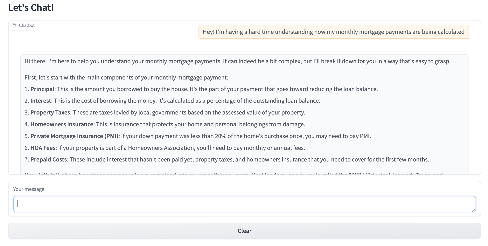

# compliant-real-estate-chatbot

## Installing required packages

We use `pip` to install the required packages. This project was tested with python 3.10 and pytorch 2.4.1. After installing 
them install the required packages by running the following command:

```bash
pip install -r requirements.txt
```

## Download the model and play with it

Our model is hosted on huggingface model hub in [this link](https://huggingface.co/zillow/realestateLM_llama3-8b). Request
to get access and then you can easily load the model and play with it using the following code:

```python
import torch
from transformers import AutoModelForCausalLM, AutoTokenizer

model_name = "zillow/realestateLM_llama3-8b"  # or use the model name if it's on Hugging Face Hub

model = AutoModelForCausalLM.from_pretrained(model_name)
tokenizer = AutoTokenizer.from_pretrained(model_name)


messages = [
    {'role': 'system', 'content': 'You are a helpful real estate chatbot. Your primary goal is to provide accurate, compliant, and useful information to users.'},
    {'role': 'user', 'content': 'how do zoning laws impact the feasibility of integrating smart grid technology in new residential developments?'}
]

input_ids = tokenizer.apply_chat_template(messages, add_generation_prompt=True)

input_t = torch.LongTensor([input_ids]).to('cuda')
output = model.generate(input_t)[:,input_t.shape[1]:]
resp = tokenizer.batch_decode(output, skip_special_tokens=True)[0]
print(resp)
```

You can also use the `evaluation/chat.py` script to load the model and chat with it on gradio:

```bash
python evaluation/chat.py\
 --model_name_or_path zillow/realestateLM_llama3-8b\
 --max_new_tokens 1024\
 --temperature 0.7
```

This will open a gradio interface where you can chat with the model:



## datasets and benchmarks

All of our synthetically generated datasets are hosted on huggingface:
- [General instructions and dialogs](https://huggingface.co/datasets/zillow/real_estate_v1)
- [Safety](https://huggingface.co/datasets/zillow/real_estate_v1_safety)
- [Benchmarks](https://huggingface.co/datasets/zillow/realestate_bench)

## Reproducing data, models and results

### generating synthetic data

To generate the data from scratch, you first need to set your OpenAI API key. You can do this by exporting it as follow:

```bash
export OPENAI_API_KEY=your-api-key
```

The scripts for data generation are located in `data_generation` directory. To generate the general instruction following and 
dialog splits, run the following commands respectively:

```bash
python data_generation/diverse_QA_datagen.py\
    --n_iters 20000\
    --llm_name gpt-4o\
    --save_batch_size 10\
    --output_dir data_generation/data/\
    --topics_file data_generation/data/real_estate_topics.txt\
    --n_subtopics 50\
    --output_file_name general_instructions.json

python data_generation/diverse_conversation_datagen.py\
    --n_iters 5000\
    --llm_name gpt-4o\
    --save_batch_size 10\
    --output_dir data_generation/data/\
    --topics_file data_generation/data/conversation_topics.txt\
    --output_file_name dialogs.json
```

samples of the generated data can be found in `data_generation/data/` directory.

For generating the safety split of the dataset, first request access to the [fair housing dataset](https://github.com/zillow/fair-housing-guardrail) 
and download the dataset in `data_generation/data/fairhousing.json` directory. Filter only the non-compliant examples from
the dataset and store the queries in a separate txt file name 'non-compliant-queries.txt' (first section of `data_preparation.ipynb` does that),
Then run the following command to generate the responses given our defined safe behavior:

```bash
python data_generation/response_generator.py\
    --query_file data_generation/data/non-compliant-queries.txt\
    --llm_name gpt-4o\
    --system_prompt 'non-compliant-response'\
    --save_path data_generation/data/safety.json
```

You can then follow the rest of the `data_preparation.ipynb` notebook to postprocess the generated data, including conversion
to LLM chat format, pruning the dataset using `sentence_bert` transformer, and splitting the data into train, validation and test sets.

### Fine-tuning the model

To fine-tune the model, you can run the `training/run_trainer.sh` script. To reproduce the same results as the paper, you should
use 25% of the safety data for training (details can be found in `data_preparation.ipynb` notebook). The rest of the configs are
set in the script. Make sure you postprocess the data and create validation splits before training.

### Running the evaluations

#### G-Eval metrics on held-out test set

We use amazon bedrock to generate responses for our baseline models. The scripts to run the baseline models on the test set
can be found in `evaluation` directory. To run the baseline models, you need to set your bedrock API key first.
Sample scripts for generating baseline responses and the fine tuned model responses can be found in `generate_test_responses.sh` script.

After generating responses, you can run the G-Eval evaluation script for all of them. Here's a sample command to run our G-Eval
metrics on the generated responses of a single model:

```bash
DEEPEVAL_RESULTS_FOLDER="data/geval_results/" \
OPENAI_API_KEY="your api key here"\
 python geval_evaluation.py --test_data_path path_to_generated_responses_by_some_model.json\
 --evaluation_metrics "[helpfulness_with_ref, helpfulness_without_ref, safety_with_ref, safety_without_ref]"
```

Our head-to-head comparison result can be seen in the figure below, it illustrates the win rate of each model on the left
versus the top model with one percent difference threshold for ties. After running the evaluation,
you can use the `result_analysis.ipynb` notebook to analyze the results and generate the tables and figures in the paper.


#### Benchmarks and Judge LLM evaluation

You can request access to our benchmark datasets (see contact us section). Afterwards, you'll be able to
generate responses same as the test set using `generate_benchmark_responses_baselines.py` and `generate_benchmark_responses_lora.py`.
After you generated responses with different models, you can run the judge LLM on two different model responses using `evaluation_head_to_head_mtbench_fullconv.py`.
Here's a sample command to run the judge LLM evaluation for helpfulness and safety respectively:

```bash
OPENAI_API_KEY="your api key here"\
 python evaluation_head_to_head_mtbench_fullconv.py --model1_response_file path_to_model1_respones.json\
 --model2_response_file path_to_model2_responses.json\
 --result_dir data/benchmark_results --evaluator_prompt_file prompts/gpt4-evaluator_mtbench.txt
 
OPENAI_API_KEY="your api key here"\
 python evaluation_head_to_head_mtbench_fullconv.py --model1_response_file path_to_model1_respones.json\
 --model2_response_file path_to_model2_responses.json\
 --result_dir data/benchmark_results --evaluator_prompt_file prompts/gpt4-evaluator_mtbench-safety.txt
```